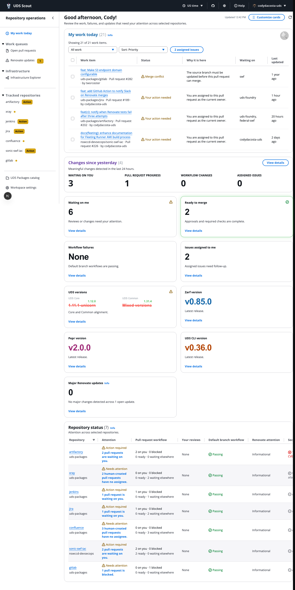
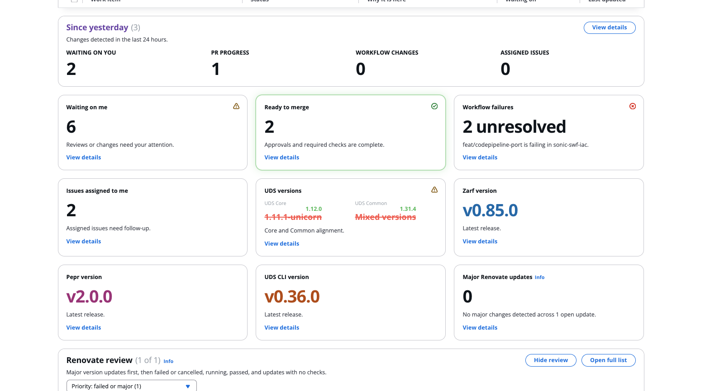
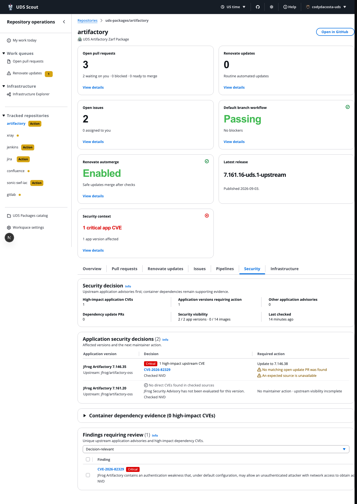
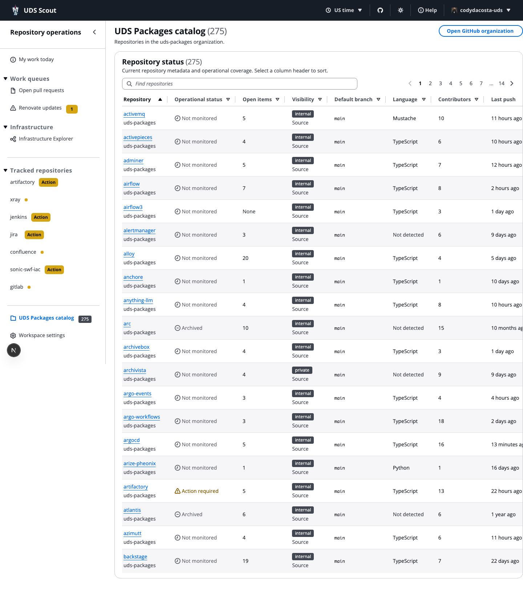

# UDS Scout

[](https://github.com/codydacosta-uds/uds-scout/actions/workflows/ci.yml)
[](https://github.com/codydacosta-uds/uds-scout/actions/workflows/security.yml)
[](https://github.com/codydacosta-uds/uds-scout/actions/workflows/container-security.yml)
[](https://github.com/codydacosta-uds/uds-scout/actions/workflows/e2e.yml)
[](https://github.com/codydacosta-uds/uds-scout/actions/workflows/scorecard.yml)
[](#validation)

**UDS Scout tells UDS package maintainers what needs attention today, why it needs attention, and where to continue the work.**

Scout was built to reduce the effort of maintaining UDS packages across multiple repositories. It is a local repository-operations workspace for maintainers who otherwise have to visit multiple GitHub pages and tools to reconstruct pull-request work, failing pipelines, Renovate updates, ownership, version alignment, and repository security context.

Scout collects, normalizes, and prioritizes that information. It does not replace GitHub or the underlying systems: when deeper investigation or a change is needed, Scout links you back to the source system.

## See Scout in action

These screenshots use current repository data from a local Scout workspace and show the light theme. The overview highlights **My work today**, repository status, operational signals, and Renovate bot updates.

| Overview | Repository status (6) and Renovate review |
| --- | --- |
| [](public/screenshots/overview.png) | [](public/screenshots/overview-cards.png) |

| Repository health | UDS Packages catalog |
| --- | --- |
| [](public/screenshots/security.png) | [](public/screenshots/packages.png) |

[View a repository detail screenshot](public/screenshots/repository-jenkins.png)

## The maintainer workflow

1. Select the repositories you maintain.
2. Scout collects their current operational state.
3. **My work today** prioritizes reviews, blockers, failed checks, dependency updates, and assigned work.
4. Each selected repository includes operational, dependency, version-alignment, and security context; coverage is explicit when evidence is unavailable.
5. Follow the source links to GitHub, a registry, or another underlying system for detailed investigation or action.

For example, a Renovate pull request with failed checks or a conflict is surfaced ahead of a routine update. The routine update remains visible, but it does not compete with work that currently needs intervention.

## What Scout shows

### My work today

The daily queue brings together work that may require a decision or handoff:

- Pull requests assigned to you or requesting your review
- Blocked, conflicting, merge-ready, or unowned human pull requests
- Failed checks and workflows that are unresolved or block an open pull request
- Renovate updates with failed checks, conflicts, direct requests, or major-version changes
- Issues assigned to you
- A **Changes since yesterday** briefing for recent review, assignment, workflow, recovery, and issue changes

Scout preserves the author, assignees, reviewers, required checks, mergeability, conflicts, and waiting-on context so the reason for each item is visible before you leave the dashboard.

### Repository health

Every selected repository gets a repository workspace with the context available for that repository:

- Pull requests, review state, ownership, assignments, and merge blockers
- Current and unresolved GitHub Actions failures, including failed jobs and steps when GitHub provides them
- Dependency and Renovate updates, including update type, check state, and intervention signals
- UDS Core and UDS Common version/configuration alignment where applicable
- Repository metadata, issues, releases, and source links
- **Repository security context**, described below

Scout refreshes GitHub data every 60 seconds and on page load while retaining cached content during route changes and transient refresh failures.

### Repository security context

Security is part of repository health, not a separate product or optional workflow. When a repository is selected, Scout automatically attempts to establish the security context available for it.

Scout progressively uses package definitions, upstream product identity, advisories, OCI metadata, SBOMs, attestations, and related public evidence to answer maintainer questions:

- Is the package affected?
- Which package version, flavor, image, or digest is affected?
- Is a fixed version available?
- Is there already an update pull request?
- Are its checks passing?
- What evidence and coverage support the conclusion?

Coverage is reported explicitly as full, partial, unknown, or unavailable. Missing evidence is never presented as zero vulnerabilities. Scout separates application findings from container-dependency findings and leads with actionable Critical and High upstream application decisions.

Security context supports package-level decisions; it does not replace enterprise vulnerability management, runtime security, or maintainer judgment. The technical security sources and normalization details are in [`docs/security.md`](docs/security.md).

### Renovate and dependencies

Renovate updates are authored by Renovate and identified from their `renovate/*` source branches. Scout separates routine updates from updates that need intervention and provides a focused review queue for failed, cancelled, running, or major-version changes. It links each update back to its pull request and checks rather than attempting to merge or modify it.

### UDS package catalog

The UDS Packages catalog provides a searchable, sortable, paginated view of the configured package repositories and contributor totals. It is a discovery and status surface, not a replacement for repository work in GitHub.

## Safety and data boundaries

- Scout monitors only repositories explicitly selected in the workspace; it does not expand to every repository visible to the token.
- Scout runs locally. It does not require a hosted Scout service, database, worker, or external Scout backend.
- Credentials are read by server-side Next.js code and are never returned to browser code or API responses.
- GitHub is read-only except for an explicitly confirmed re-run of a selected failed job or workflow.
- Scout does not silently mutate repositories.
- Setup credentials remain in the running server process; environment credentials remain outside persisted Scout settings.
- Only documented non-secret workspace preferences and local security cache data are persisted.
- Security enrichment uses public Defense Unicorns Registry metadata and never requests or stores private-registry credentials.
- The development server binds to `127.0.0.1`. Docker is published on `127.0.0.1:3001` by the documented commands and runs the application as a non-root user.

## Run locally

### Prerequisites

- Node.js 22 recommended
- npm
- A GitHub token with read access to the repositories you intend to select
- Organization authorization when a selected repository enforces SSO
- Optional Actions write permission if Scout should re-run selected failed jobs or workflows
- Optional [Task](https://taskfile.dev/) (`brew install go-task` on macOS)

### Start with npm

```bash
npm install
npm run dev
```

Open [http://127.0.0.1:3001](http://127.0.0.1:3001). The development server uses port `3001`.

### Configure the workspace

On first boot:

1. Connect or confirm the GitHub token.
2. Select the GitHub repositories Scout should monitor.
3. Save the workspace and continue to the dashboard.

Credentials are validated by the server. Non-secret selections are stored with local-user permissions at `~/.config/uds-scout/settings.json`. Existing `~/.config/d2d-operations/settings.json` settings continue to load when the new path does not yet exist.

Repository quick-select groups are defined in [`config/repository-groups.json`](config/repository-groups.json). You can also copy `.env.local.example` to `.env.local`; never commit real credentials.

### Environment variables

| Variable | Required | Purpose |
| --- | --- | --- |
| `GITHUB_TOKEN` | Yes, unless entered during setup | Server-only GitHub API token |
| `GH_TOKEN` | No | Fallback GitHub token name |
| `NVD_API_KEY` | No | Optional server-only NVD API key for faster advisory refreshes |
| `GITHUB_REPOSITORIES` | No | Comma-separated repository override |
| `UDS_SCOUT_SETTINGS_PATH` | No | Alternate non-secret settings path |
| `UDS_SCOUT_SECURITY_PATH` | No | Alternate local security-cache path |

## Run with Docker

Docker builds a standalone production image, runs it as a non-root user, and persists non-secret workspace settings in a named volume.

```bash
git clone https://github.com/codydacosta-uds/uds-scout.git
cd uds-scout
task docker:start
```

Open [http://127.0.0.1:3001](http://127.0.0.1:3001). `task docker:start` supplies `.env.local` at runtime when present; credentials are never image build arguments. Useful commands:

```bash
task docker:logs
task docker:stop
task update
```

For unattended startup, keep credentials in a protected runtime `.env.local` file or the host’s secret mechanism. Do not bake credentials into the image.

## Documentation and source map

- [`docs/security.md`](docs/security.md) — security evidence, coverage states, sources, and normalization
- [`CHANGELOG.md`](CHANGELOG.md) — released and upcoming user-facing changes
- [`components/OperationsConsole.tsx`](components/OperationsConsole.tsx) — shell, navigation, loading, and caching
- [`components/OverviewPage.tsx`](components/OverviewPage.tsx) — My work today, repository health, and work queues
- [`lib/github.ts`](lib/github.ts) — server-side GitHub access and caching
- [`lib/security-service.ts`](lib/security-service.ts) — repository security enrichment
- [`config/repository-groups.json`](config/repository-groups.json) — configured repository groups

## Validation

Run the complete local validation set with `task check`, or directly with:

```bash
npm run lint
npm run test:coverage
npm run coverage:badge
npm run test:runner
npm run build
```

Use `npm test` for fast unit tests and `npm run test:e2e` after installing Chromium with `npx playwright install chromium`.

CI also runs production dependency auditing, source/secret/configuration scanning, production image vulnerability and secret scanning, ShellCheck, browser smoke tests, and an OpenSSF Scorecard scan. CodeQL and dependency review run when GitHub Advanced Security is enabled.

See [`SECURITY.md`](SECURITY.md) for vulnerability reporting.
