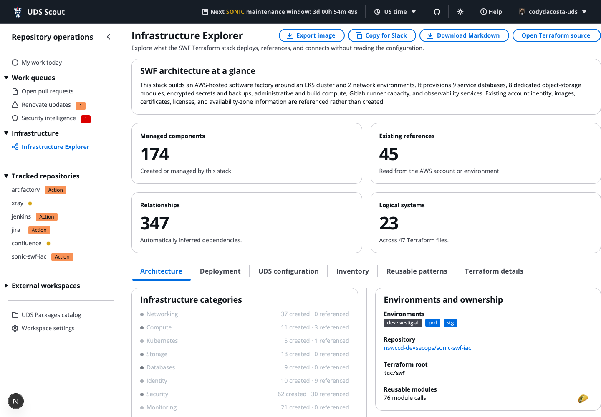

# SONIC Infrastructure Explorer

The Infrastructure Explorer is a SONIC-specific view for understanding deployed infrastructure, ownership, and recovery dependencies. It is kept separate from the general UDS Scout introduction.

